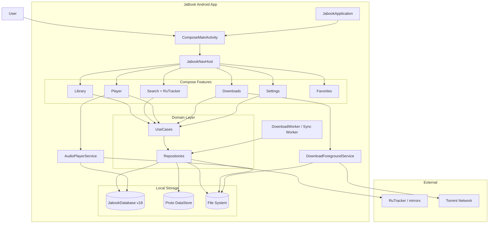
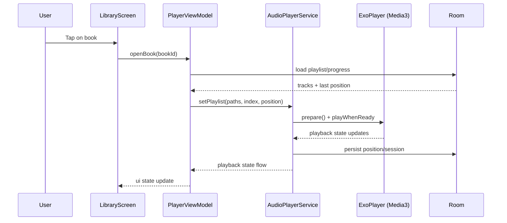
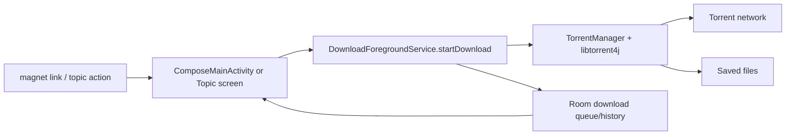

# JaBook

[](https://ko-fi.com/I2I81X6E3R)
[](https://www.android.com/)
[](https://kotlinlang.org/)
[](https://developer.android.com/media/media3)
[](LICENSE)

A modern Android audiobook player with RuTracker integration, offline-first library management, torrent-based delivery, and a native Media3 playback service.

> [!WARNING]
> **Disclaimer**
> - This project is not affiliated with RuTracker.
> - The authors are not responsible for how the app is used or for downloaded content.
> - Users are fully responsible for complying with copyright laws in their jurisdiction.

## Table of Contents

- [What's Inside](#whats-inside)
- [Architecture and Interaction](#architecture-and-interaction)
- [Project Map](#project-map)
- [Tech Stack](#tech-stack)
- [Quick Start](#quick-start)
- [Development Commands](#development-commands)
- [Testing and Quality](#testing-and-quality)
- [Architecture Docs](#architecture-docs)
- [Contributing](#contributing)
- [License](#license)

## What's Inside

- Fully Compose UI with type-safe navigation and deep links (`magnet:`, `jabook://...`)
- Native `AudioPlayerService` on Media3 (`MediaLibraryService`) with background playback
- Torrent downloads via `libtorrent4j` with Room-backed queue/history
- Offline-first data model: Room (`JabookDatabase`, schema v18) + Proto DataStore
- Separate high-performance RuTracker indexing tool: [`rutracker_parser/`](rutracker_parser/README.md)
- Android flavors: `dev`, `stage`, `beta`, `prod`

## Architecture and Interaction

### 1) High-Level Architecture



### 2) Playback Scenario (Sequence)



### 3) Download Scenario (Magnet -> Files)



### 4) UI <-> Data Flow

```mermaid
flowchart TB
    UI[Compose UI]
    VM[ViewModel]
    UC[UseCase]
    REPO[Repository]
    ROOM[(Room)]
    DS[(Proto DataStore)]
    NET[Network (Retrofit/OkHttp/Jsoup)]

    UI --> VM --> UC --> REPO
    REPO --> ROOM
    REPO --> DS
    REPO --> NET
    ROOM -.Flow.-> REPO
    DS -.Flow.-> REPO
    REPO -.Flow.-> UC -.StateFlow.-> VM -.State.-> UI
```

## Project Map

```text
.
├── android/                          # Android app
│   ├── app/
│   │   └── src/main/kotlin/com/jabook/app/jabook/
│   │       ├── compose/              # UI, feature modules, navigation, DI
│   │       ├── audio/                # Media3 service and audio pipeline
│   │       ├── torrent/              # Torrent manager
│   │       ├── download/             # Foreground download service/worker
│   │       ├── migration/            # Data migration logic
│   │       └── ...
│   └── gradle/
├── docs/                             # Quarto + Mermaid architecture docs
├── rutracker_parser/                 # Python CLI indexer/crawler for RuTracker
├── makefiles/                        # Modular make targets
└── README.md
```

### Key Entry Points

- Application: [`android/app/src/main/kotlin/com/jabook/app/jabook/JabookApplication.kt`](android/app/src/main/kotlin/com/jabook/app/jabook/JabookApplication.kt)
- Main Activity: [`android/app/src/main/kotlin/com/jabook/app/jabook/compose/ComposeMainActivity.kt`](android/app/src/main/kotlin/com/jabook/app/jabook/compose/ComposeMainActivity.kt)
- Navigation: [`android/app/src/main/kotlin/com/jabook/app/jabook/compose/navigation/JabookNavHost.kt`](android/app/src/main/kotlin/com/jabook/app/jabook/compose/navigation/JabookNavHost.kt)
- Audio Service: [`android/app/src/main/kotlin/com/jabook/app/jabook/audio/AudioPlayerService.kt`](android/app/src/main/kotlin/com/jabook/app/jabook/audio/AudioPlayerService.kt)
- Room DB: [`android/app/src/main/kotlin/com/jabook/app/jabook/compose/data/local/JabookDatabase.kt`](android/app/src/main/kotlin/com/jabook/app/jabook/compose/data/local/JabookDatabase.kt)
- Torrent Manager: [`android/app/src/main/kotlin/com/jabook/app/jabook/torrent/TorrentManager.kt`](android/app/src/main/kotlin/com/jabook/app/jabook/torrent/TorrentManager.kt)

## Tech Stack

| Category | Technologies |
|---|---|
| Language | Kotlin 2.3.20 |
| UI | Jetpack Compose (BOM `2026.03.01`), Material3 Adaptive |
| Architecture | MVVM + UseCase/Repository + Flow |
| DI | Dagger Hilt + KSP |
| Storage | Room 2.8.4 (`JabookDatabase` v18), Proto DataStore 1.2.1 |
| Audio | Media3 1.10.0 (ExoPlayer + Session + Notification) |
| Network | OkHttp 5.3.2, Retrofit 3.0.0, Jsoup 1.22.1 |
| Torrent | libtorrent4j 2.1.0-39 |
| Images | Coil 3.4.0 |
| Quality | ktlint 14.2.0, detekt, JaCoCo 0.8.14 |

Minimum Android version: **API 30 (Android 11)**  
Target SDK: **36**  
Compile SDK: **37**

## Quick Start

### 1) Prerequisites

- JDK 21
- Android SDK (API 30+)
- Android Studio
- Git

### 2) Clone

```bash
git clone git@github.com:Gosayram/jabook.git
cd jabook
```

### 3) Build Android App

```bash
cd android
./gradlew :app:assembleBetaDebug
```

### 4) Install on Device

```bash
./gradlew :app:installBetaDebug
```

## Development Commands

### Gradle (from `android/`)

```bash
./gradlew :app:assembleBetaDebug
./gradlew :app:testBetaDebugUnitTest :app:testProdDebugUnitTest
./gradlew :app:ktlintCheck :app:detekt
./gradlew :app:jacocoTestReport
./gradlew :app:jacocoCoverageVerification
```

### Make (from repo root)

```bash
make help
make build-dev
make build-beta
make build-prod
make compile
make lint-kotlin
make test
make test-coverage
make android-lint
```

<details>
<summary>Flavors and what they do</summary>

- `dev` -> `applicationIdSuffix=.dev`, `versionNameSuffix=-dev`
- `stage` -> `applicationIdSuffix=.stage`, `versionNameSuffix=-stage`
- `beta` -> `applicationIdSuffix=.beta`, `versionNameSuffix=-beta`
- `prod` -> production flavor without suffix

App version is read from `.release-version` (`x.y.z+build`).

</details>

## Testing and Quality

- Unit tests: `:app:testBetaDebugUnitTest`, `:app:testProdDebugUnitTest`
- Coverage report: `:app:jacocoTestReport`
- Coverage gate: `:app:jacocoCoverageVerification` (**minimum 85%**)
- Linting/formatting: `ktlint` + `detekt` + Android Lint

## Architecture Docs

Full visual documentation (Quarto + 45+ Mermaid diagrams) is available in [`docs/`](docs/README.md):

- System architecture
- Navigation and state diagrams
- Room ERD
- Audio subsystem
- Download subsystem
- Dependency injection graph
- Feature module boundaries

Local preview:

```bash
cd docs
quarto preview
```

## Contributing

1. Create a feature branch.
2. Build relevant flavor(s), run tests and linters.
3. Update documentation in `docs/` for architecture-impacting changes.
4. Make sure coverage and quality gates still pass.
5. Open a PR with scope, risk notes, and verification steps.

## License

This project is licensed under Apache 2.0.  
See [`LICENSE`](LICENSE).

## Changelog

Release history: [`CHANGELOG.md`](CHANGELOG.md)
