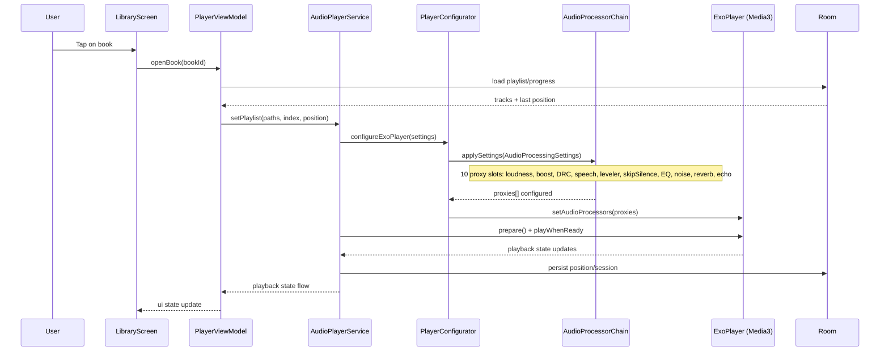
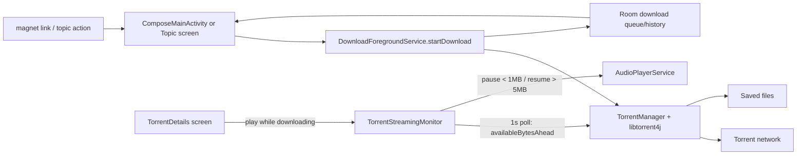
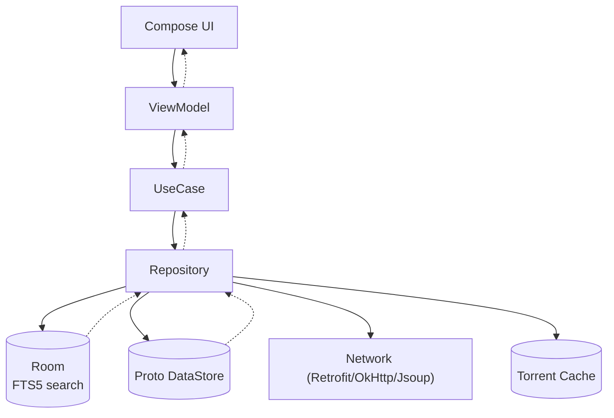
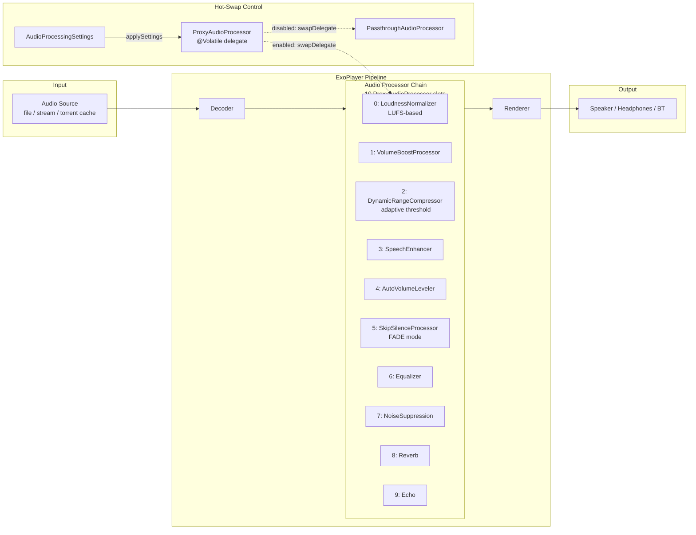

# JaBook

[](https://ko-fi.com/I2I81X6E3R)
[](https://www.android.com/)
[](https://kotlinlang.org/)
[](https://developer.android.com/media/media3)
[](LICENSE)

A modern Android audiobook player with RuTracker integration, offline-first library management, torrent-based delivery, and a native Media3 playback service.

> [!WARNING]
> **Disclaimer**
> - This project is not affiliated with RuTracker.
> - The authors are not responsible for how the app is used or for downloaded content.
> - Users are fully responsible for complying with copyright laws in their jurisdiction.

## Table of Contents

- [What's Inside](#whats-inside)
- [Architecture and Interaction](#architecture-and-interaction)
- [Project Map](#project-map)
- [Tech Stack](#tech-stack)
- [Quick Start](#quick-start)
- [Development Commands](#development-commands)
- [Testing and Quality](#testing-and-quality)
- [Architecture Docs](#architecture-docs)
- [Contributing](#contributing)
- [License](#license)

## What's Inside

- Fully Compose UI with type-safe navigation and deep links (`magnet:`, `jabook://...`)
- Native `AudioPlayerService` on Media3 (`MediaLibraryService`) with background playback
- Torrent downloads via `libtorrent4j` with Room-backed queue/history
- Offline-first data model: Room (`JabookDatabase`, schema v26) + Proto DataStore
- Separate high-performance RuTracker indexing tool: [`rutracker_parser/`](rutracker_parser/README.md)
- Android flavors: `dev`, `stage`, `beta`, `prod`
- Advanced audio processing pipeline: loudness normalization, dynamic range compression, equalizer, noise suppression, reverb, skip silence, speech enhancement
- Player gestures, lyrics (LRC), sleep timer, speed memory, bookmarks, audio visualizer
- Onboarding with spotlight overlay, achievements system, library heatmaps, year recap
- Discovery screen, in-app WebView, mini player overlay

## Architecture and Interaction

### 1) High-Level Architecture


```mermaid
flowchart TB
    User[User]

    subgraph AndroidApp[JaBook Android App]
        App[JabookApplication]
        Activity[ComposeMainActivity]
        Nav[JabookNavHost]

        subgraph Features[Compose Features]
            Library[Library\n grid/list/heatmap]
            Search[Search\n offline FTS + online]
            RuTracker[RuTracker Search\n with covers]
            Player[Player\n gestures/lyrics/visualizer]
            Downloads[Downloads\n drag-drop]
            TorrentDL[Torrent Details\n streaming monitor]
            Settings[Settings\n audio/scan]
            Favorites[Favorites]
            Topic[Topic\n spoilers]
            Onboarding[Onboarding\n spotlight]
            Achievements[Achievements]
            MiniPlayer[Mini Player\n overlay]
            WebView[WebView\n magnet detect]
        end

        subgraph Domain[Domain Layer]
            UseCases[UseCases]
            Repos[Repositories]
        end

        subgraph Storage[Local Storage]
            Room[(JabookDatabase v26\n 12 entities\n FTS5 books + topics)]
            Proto[(Proto DataStore)]
            FS[(File System)]
            Cache[(Media3 Cache)]
        end

        subgraph AudioSubsystem[Audio Subsystem]
            AudioService[AudioPlayerService\n MediaLibraryService]
            Processors[Audio Processor Chain\n 10 hot-swap proxy slots]
            CrossFade[CrossFadePlayer]
            SleepTimer[SleepTimerManager]
            Visualizer[AudioVisualizerManager]
        end

        TorrentService[DownloadForegroundService]
        TorrentMonitor[TorrentStreamingMonitor\n 1s polling\n auto buffer/pause]
        Worker[DownloadWorker / Sync Worker]
    end

    subgraph External[External]
        RT[RuTracker / mirrors]
        TorrentNet[Torrent Network]
    end

    User --> Activity
    App --> Activity
    Activity --> Nav
    Nav --> Library
    Nav --> Search
    Nav --> RuTracker
    Nav --> Player
    Nav --> Downloads
    Nav --> TorrentDL
    Nav --> Settings
    Nav --> Favorites
    Nav --> Topic
    Nav --> Onboarding
    Nav --> WebView

    Library --> UseCases
    Search --> UseCases
    RuTracker --> UseCases
    Player --> UseCases
    Downloads --> UseCases
    Settings --> UseCases
    UseCases --> Repos

    Repos --> Room
    Repos --> Proto
    Repos --> FS
    Repos --> RT

    Player --> AudioService
    AudioService --> Processors
    AudioService --> CrossFade
    AudioService --> SleepTimer
    AudioService --> Visualizer
    AudioService --> Cache
    AudioService --> Room
    Processors -.->|hot-swap delegates| AudioService

    Downloads --> TorrentService
    TorrentDL --> TorrentMonitor
    TorrentMonitor -->|pause/play| AudioService
    TorrentService --> TorrentNet
    TorrentService --> FS
    TorrentService --> Cache
    Worker --> Repos
    MiniPlayer -.->|StateFlow| AudioService
```

### 2) Playback Scenario (Sequence)


```mermaid
sequenceDiagram
    participant U as User
    participant L as LibraryScreen
    participant VM as PlayerViewModel
    participant S as AudioPlayerService
    participant PC as PlayerConfigurator
    participant CH as AudioProcessorChain
    participant E as ExoPlayer (Media3)
    participant DB as Room

    U->>L: Tap on book
    L->>VM: openBook(bookId)
    VM->>DB: load playlist/progress
    DB-->>VM: tracks + last position
    VM->>S: setPlaylist(paths, index, position)
    S->>PC: configureExoPlayer(settings)
    PC->>CH: applySettings(AudioProcessingSettings)
    Note over CH: 10 proxy slots: loudness, boost, DRC, speech, leveler, skipSilence, EQ, noise, reverb, echo
    CH-->>PC: proxies[] configured
    PC->>E: setAudioProcessors(proxies)
    S->>E: prepare() + playWhenReady
    E-->>S: playback state updates
    S->>DB: persist position/session
    S-->>VM: playback state flow
    VM-->>L: ui state update
```

### 3) Download Scenario (Magnet -> Files)


```mermaid
flowchart LR
    A[magnet link / topic action]
    B[ComposeMainActivity or Topic screen]
    C[DownloadForegroundService.startDownload]
    D[TorrentManager + libtorrent4j]
    E[Torrent network]
    F[Saved files]
    G[Room download queue/history]
    H[TorrentDetails screen]
    I[TorrentStreamingMonitor]

    A --> B --> C --> D --> E
    D --> F
    C --> G
    G --> B
    H -->|play while downloading| I
    I -->|1s poll: availableBytesAhead| D
    I -->|pause < 1MB / resume > 5MB| J[AudioPlayerService]
```

### 4) UI <-> Data Flow


```mermaid
flowchart TB
    UI[Compose UI]
    VM[ViewModel]
    UC[UseCase]
    REPO[Repository]
    ROOM[(Room\n FTS5 search)]
    DS[(Proto DataStore)]
    NET["Network (Retrofit/OkHttp/Jsoup)"]
    TORRENT[(Torrent Cache)]

    UI --> VM --> UC --> REPO
    REPO --> ROOM
    REPO --> DS
    REPO --> NET
    REPO --> TORRENT
    ROOM -.-> REPO
    DS -.-> REPO
    REPO -.-> UC
    UC -.-> VM
    VM -.-> UI
```

### 5) Audio Processing Pipeline


```mermaid
flowchart LR
    subgraph Input[Input]
        SRC[Audio Source\n file / stream / torrent cache]
    end

    subgraph ExoPlayer[ExoPlayer Pipeline]
        D[Decoder]
        subgraph Chain[Audio Processor Chain\n 10 ProxyAudioProcessor slots]
            direction TB
            P0[0: LoudnessNormalizer\n LUFS-based]
            P1[1: VolumeBoostProcessor]
            P2[2: DynamicRangeCompressor\n adaptive threshold]
            P3[3: SpeechEnhancer]
            P4[4: AutoVolumeLeveler]
            P5[5: SkipSilenceProcessor\n FADE mode]
            P6[6: Equalizer]
            P7[7: NoiseSuppression]
            P8[8: Reverb]
            P9[9: Echo]
        end
        R[Renderer]
    end

    subgraph Output[Output]
        SPEAKER[Speaker / Headphones / BT]
    end

    SRC --> D --> Chain --> R --> SPEAKER

    subgraph Control[Hot-Swap Control]
        SETTINGS[AudioProcessingSettings]
        PROXY[ProxyAudioProcessor\n @Volatile delegate]
        PASS[PassthroughAudioProcessor]
    end

    SETTINGS -->|applySettings| PROXY
    PROXY -.->|enabled: swapDelegate| P0
    PROXY -.->|disabled: swapDelegate| PASS
```

## Project Map

```text
.
├── android/                          # Android app
│   ├── app/
│   │   └── src/main/kotlin/com/jabook/app/jabook/
│   │       ├── compose/
│   │       │   ├── feature/          # 18 feature modules
│   │       │   │   ├── library/      # Library, grid/list, heatmaps, year recap
│   │       │   │   ├── player/       # Player, gestures, lyrics, visualizer, sleep timer
│   │       │   │   ├── search/       # Search + RuTracker integration
│   │       │   │   ├── torrent/      # Torrent downloads, details, streaming
│   │       │   │   ├── settings/     # Settings, audio settings, scan settings
│   │       │   │   ├── favorites/    # Favorites management
│   │       │   │   ├── downloads/    # Download history, drag-drop
│   │       │   │   ├── topic/        # Topic detail with spoiler support
│   │       │   │   ├── auth/         # Authentication
│   │       │   │   ├── onboarding/   # Onboarding with spotlight overlay
│   │       │   │   ├── achievements/ # Achievement system
│   │       │   │   ├── discovery/    # Content discovery
│   │       │   │   ├── miniplayer/   # Mini player overlay
│   │       │   │   ├── webview/      # In-app WebView
│   │       │   │   ├── indexing/     # Indexing progress UI
│   │       │   │   ├── permissions/  # Permission screen
│   │       │   │   ├── debug/        # Debug screen
│   │       │   │   └── migration/    # Data migration
│   │       │   ├── data/             # Repositories, local/remote sources
│   │       │   ├── domain/           # Use cases, models
│   │       │   ├── di/               # Hilt DI modules
│   │       │   └── navigation/       # Navigation graph
│   │       ├── audio/                # Media3 service and audio pipeline
│   │       │   └── processors/       # 25+ audio processors (LUFS, DRC, EQ, reverb...)
│   │       ├── torrent/              # Torrent manager (libtorrent4j)
│   │       ├── download/             # Foreground download service/worker
│   │       └── migration/            # Data migration logic
│   └── gradle/
├── docs/                             # Quarto + Mermaid architecture docs
├── rutracker_parser/                 # Python CLI indexer/crawler for RuTracker
├── makefiles/                        # Modular make targets
└── README.md
```

### Key Entry Points

- Application: [`android/app/src/main/kotlin/com/jabook/app/jabook/JabookApplication.kt`](android/app/src/main/kotlin/com/jabook/app/jabook/JabookApplication.kt)
- Main Activity: [`android/app/src/main/kotlin/com/jabook/app/jabook/compose/ComposeMainActivity.kt`](android/app/src/main/kotlin/com/jabook/app/jabook/compose/ComposeMainActivity.kt)
- Navigation: [`android/app/src/main/kotlin/com/jabook/app/jabook/compose/navigation/JabookNavHost.kt`](android/app/src/main/kotlin/com/jabook/app/jabook/compose/navigation/JabookNavHost.kt)
- Audio Service: [`android/app/src/main/kotlin/com/jabook/app/jabook/audio/AudioPlayerService.kt`](android/app/src/main/kotlin/com/jabook/app/jabook/audio/AudioPlayerService.kt)
- Audio Processors: [`android/app/src/main/kotlin/com/jabook/app/jabook/audio/processors/`](android/app/src/main/kotlin/com/jabook/app/jabook/audio/processors/)
- Room DB: [`android/app/src/main/kotlin/com/jabook/app/jabook/compose/data/local/JabookDatabase.kt`](android/app/src/main/kotlin/com/jabook/app/jabook/compose/data/local/JabookDatabase.kt)
- Torrent Manager: [`android/app/src/main/kotlin/com/jabook/app/jabook/torrent/TorrentManager.kt`](android/app/src/main/kotlin/com/jabook/app/jabook/torrent/TorrentManager.kt)
- Version Catalog: [`android/gradle/libs.versions.toml`](android/gradle/libs.versions.toml)

## Tech Stack

| Category | Technologies |
|---|---|
| Language | Kotlin 2.3.21 |
| UI | Jetpack Compose (BOM `2026.05.01`), Material3 Adaptive |
| Architecture | MVVM + UseCase/Repository + Flow |
| DI | Dagger Hilt 2.59.2 + KSP |
| Storage | Room 2.8.4 (`JabookDatabase` v26), Proto DataStore 1.2.1 |
| Audio | Media3 1.10.1 (ExoPlayer + Session + Notification) |
| Audio Processing | 25+ processors (LUFS normalization, DRC, equalizer, reverb, noise suppression, speech enhancement) |
| Network | OkHttp 5.3.2, Retrofit 3.0.0, Jsoup 1.22.2 |
| Torrent | libtorrent4j 2.1.0-39 |
| Images | Coil 3.4.0 |
| Effects | Haze 1.7.2 (glassmorphism), HypnoticCanvas 0.4.1 (shaders) |
| Navigation | Compose Navigation 2.9.8, Material3 Adaptive Navigation |
| TV | Leanback 1.2.0 |
| Security | Tink 1.21.0 |
| Quality | ktlint 14.2.0, detekt 2.0.0-alpha.3, JaCoCo 0.8.14 |
| Testing | Kotest 6.1.11, Mockk, Turbine 1.2.1, Robolectric 4.16.1 |

Minimum Android version: **API 30 (Android 11)**  
Target SDK: **36**  
Compile SDK: **37**

## Quick Start

### 1) Prerequisites

- JDK 25 (project uses Java 25 toolchain)
- Android SDK (API 30+)
- Android Studio
- Git

### 2) Clone

```bash
git clone git@github.com:Gosayram/jabook.git
cd jabook
```

### 3) Build Android App

```bash
cd android
./gradlew :app:assembleBetaDebug
```

### 4) Install on Device

```bash
./gradlew :app:installBetaDebug
```

## Development Commands

### Gradle (from `android/`)

```bash
./gradlew :app:assembleBetaDebug
./gradlew :app:testBetaDebugUnitTest :app:testProdDebugUnitTest
./gradlew :app:ktlintCheck :app:detekt
./gradlew :app:jacocoTestReport
./gradlew :app:jacocoCoverageVerification
```

### Make (from repo root)

```bash
# Development workflows
make help              # Show all available targets
make dev               # Format -> compile -> install dev (full dev cycle)
make beta              # Format -> compile -> install beta (full beta cycle)
make prod              # Format -> compile -> install prod (full prod cycle)

# Build
make build-dev         # Build dev debug APK
make build-beta        # Build beta release APK
make build-prod        # Build prod release APK
make build-bundle-prod # Build prod App Bundle (AAB)

# Quality gates
make lint              # Clean -> format -> compile (full lint cycle)
make check             # Full local quality gate (lint + compile + Hilt graph)
make check-all-with-tests  # Full gate incl. strict unit tests
make compile           # Compile all flavors

# Testing
make test              # Run unit tests
make test-strict       # CI-friendly strict unit tests
make test-audio        # Audio-focused unit tests
make test-storage      # Storage/data-layer unit tests
make test-player       # Player feature unit tests
make test-coverage     # Generate coverage report

# Formatting & Linting
make fmt-kotlin        # Format Kotlin code (ktlint + detekt auto-correct)
make lint-kotlin       # Lint Kotlin code (full check)
make detekt            # Run detekt static analysis

# APK Analysis
make apk-size          # Show APK file size summary
make apk-summary       # Detailed APK composition breakdown
make apk-compare       # Compare two APKs (OLD_APK=a NEW_APK=b)
make android-lint      # Run Android Lint via Gradle
```

<details>
<summary>Flavors and what they do</summary>

- `dev` -> `applicationIdSuffix=.dev`, `versionNameSuffix=-dev`
- `stage` -> `applicationIdSuffix=.stage`, `versionNameSuffix=-stage`
- `beta` -> `applicationIdSuffix=.beta`, `versionNameSuffix=-beta`
- `prod` -> production flavor without suffix

App version is read from `.release-version` (`x.y.z+build`).

</details>

## Testing and Quality

- Unit tests: `make test` (or `:app:testBetaDebugUnitTest`, `:app:testProdDebugUnitTest`)
- Specialized suites: `make test-audio`, `make test-storage`, `make test-player`
- Coverage report: `make test-coverage`
- Coverage gate: `:app:jacocoCoverageVerification` (**minimum 85%**)
- Linting/formatting: `ktlint` + `detekt` + Android Lint
- Full quality gate: `make check` (lint + compile + Hilt graph validation)

## Architecture Docs

Full visual documentation (Quarto + 45+ Mermaid diagrams) is available in [`docs/`](docs/README.md):

- System architecture
- Navigation and state diagrams
- Room ERD
- Audio subsystem
- Download subsystem
- Dependency injection graph
- Feature module boundaries

Local preview:

```bash
cd docs
quarto preview
```

## Contributing

1. Create a feature branch.
2. Build relevant flavor(s), run tests and linters.
3. Update documentation in `docs/` for architecture-impacting changes.
4. Make sure coverage and quality gates still pass.
5. Open a PR with scope, risk notes, and verification steps.

## License

This project is licensed under Apache 2.0.  
See [`LICENSE`](LICENSE).

## Changelog

Release history: [`CHANGELOG.md`](CHANGELOG.md)

## Star History

<a href="https://www.star-history.com/?repos=Gosayram%2Fjabook&type=date&legend=top-left">
 <picture>
   <source media="(prefers-color-scheme: dark)" srcset="https://api.star-history.com/chart?repos=Gosayram/jabook&type=date&theme=dark&legend=top-left" />
   <source media="(prefers-color-scheme: light)" srcset="https://api.star-history.com/chart?repos=Gosayram/jabook&type=date&legend=top-left" />
   
 </picture>
</a>
